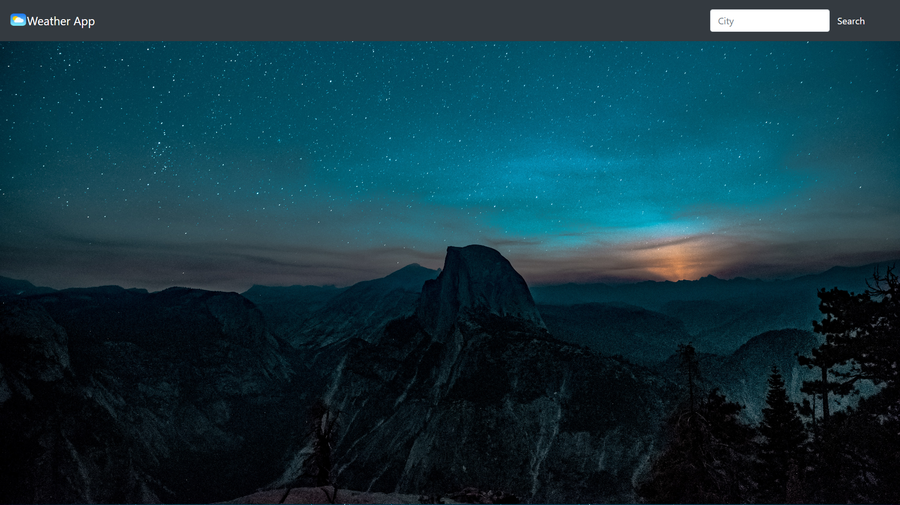
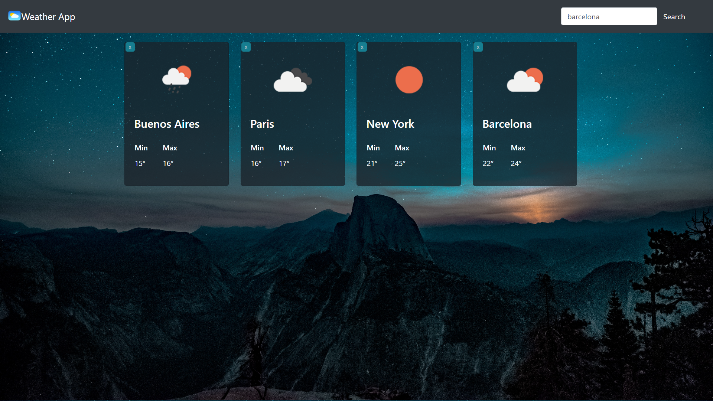
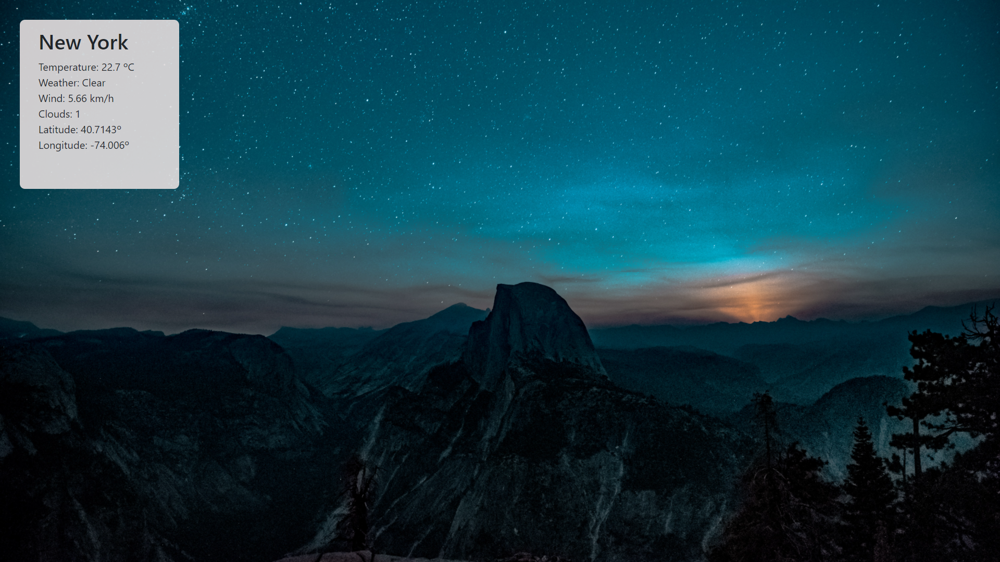

    

# Project - Weather App ⛅
Weather App is a single page application where users can find the weather of different cities all around the word. I use an external API Open Weather to bring the information.

🔹Technologies:
ReactJS -NodeJS-JavaScript-CSS

<h3>Landing Page</h3>

<h3>Cards<h3>

<h3>Card Detail<h3>

    
##  Run the next command lines to getting started 💻

First you'll have to clone this repository in a folder in your computer, then you'll have to open your console in that directory and: 

- npm install 
- npm start

This will start the app on your localhost:3000

    

